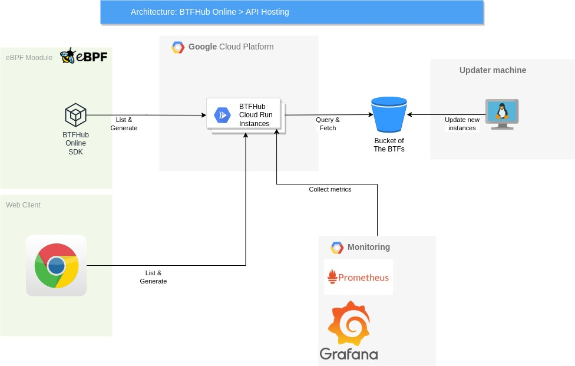

# BTFHub online
BTFHub online is the online version of the great [BTFHub project](https://github.com/aquasecurity/btfhub).
The purpose of the online version is to make it easier for developers to fetch their relevant BTF for their BPF binary.

The project will allow you to be "forward compatible" with new minor versions or patches of your kernel being released.

# The problem
In the recent years eBPF became more and more common among developers and companies. Most of them have used BCC toolkit
it was the common toolkit for eBPF. But BCC have major drawback, among them, we can find portability issue.

To overcome that issue (and some other issues) there is a movement to libbpf toolkit with the great addition of CORE
(Compile Once Run Everywhere). To use libbpf+CORE, one must supply a file called BTF (BPF Type Format) which holds data
that can tell how to make a BPF code compatible in the current host's kernel (Where to find structs in the kernel, how 
they are arranged, etc.). Latest kernel versions do have a default BTF file at `/sys/kernel/btf/vmlinux`, but older kernels
does not have such file. The solution for them is to generate such BTF files to all versions of the old kernel.
Gladly, [BTFHub](https://github.com/aquasecurity/btfhub) have done most of the hard work and generated BTFs for old kernels
and their updates. BTFHub even added a script to generate a minimized and customized BTFs for a given BPF (a BTF that contain
only relevant data to your BPF). So you can create a directory with thousands of BTFs with a few MBs.

But, unfortunately kernel can be updated, and your local directory of the BTFs might be outdated for the latest kernel update.
Here BTFHub-Online comes in!

BTFHub Online supplies an online server that is able to supply a BTF (customized or not) live!
You BPF program just need to send a request to the server, and it will immediately get the relevant BTF.
Using the online version you gain:
* "Forward compatability" to new kernel patches
* No need to generate the local directory of BTFs
* Easy integration


# Access
The server is open for free access at https://btfhub.seekret.io (checkout the [SDK list](#list-of-sdks) for easy integration)

Of course, you can set up and host your server by your own (checkout the [deployment section](#deploy))
Currently we wrap deployment for:
* k8s

# Table of Content
1. [Visual Diagram](#visual-diagram)
2. [Mode or operation](#mode-of-operation)
   1. [List of SDKs](#list-of-sdks)
3. [Examples](#examples)
4. [Docker build](#docker-build)
5. [Deploy](#deploy)
   1. [k8s](#k8s-with-kong-api-gateway-and-gcp-bucket-archive)
6. [Contributing](#contributing)
7. [TODO List](#todo-list)
8. [Credits](#credits)

# Visual Diagram


# Mode of operation
While developing your eBPF module, use our SDKs or the api documentation to dynamically pull the BTF that suites
your eBPF module.

## List of SDKs
1. [GO](https://github.com/seek-ret/btfhub-online-go)

## Examples
### Run server locally
```bash
make update-dependencies
GOOGLE_APPLICATION_CREDENTIALS=<service account json> go run cmd/btfserver/main.go -t ./tools -p 8080 -b <bucket name>
```

### List all BTFs in the server
```bash
curl "https://btfhub.seekret.io/api/v1/list"
```

### Download a single BTF
```bash
curl "https://btfhub.seekret.io/api/v1/download?distribution=ubuntu&distribution_version=20.04&kernel_version=5.11.0-1022-gcp&arch=x86_64" -o btf.tar.gz
```

### Customize a single BTF
```bash
curl -X POST "https://btfhub.seekret.io/api/v1/customize?distribution=ubuntu&distribution_version=20.04&kernel_version=5.11.0-1022-gcp&arch=x86_64" -F bpf=@<path to bpf.core.o> -o btf.tar.gz
```

### Getting metrics
```bash
curl "https://btfhub.seekret.io/monitoring/metrics"
```

### Getting health check
```bash
curl "https://btfhub.seekret.io/monitoring/health"
```

# Docker build

```bash
docker -f btfserver.Dockerfile -t "<image>" .
```

# Deploy
## K8S with kong api gateway and gcp bucket archive
```bash
helm dependency build deployments/k8s
helm upgrade -i btfhub ./deployments/k8s --set arguments.bucket_name=btfhub           \
  --set-file arguments.gcp_bucket.service_account_content=<service account json file> \
  --set-file ingress.tls.cert=<tls certificate>                                       \
  --set-file ingress.tls.key=<tls key>                                                \
  --set kong.proxy.loadBalancerIP=<external IP>                                       \
  --set ingress.host=<btfhub.example.com>                                             \
  --set "ingress.domain=<*.company.com>" 
```

# Contributing

We are welcome you to contribute in any manner there is.
We care a lot from the community, thus please read our [code of conduct](./CODE_OF_CONDUCT.md) before contributing.
You don't have to develop to contribute to the community, and you can do it in one of the following ways:

1. Open issues (bugs, feature requests)
2. Develop the code (read [contributing.md](./CONTRIBUTING.md))
   1. Check the [TODO List](#todo-list) to find good issues to start with.
3. Mention us (twitter, linkedin, blogs)

# TODO List
 - [ ] Add more http metrics
 - [ ] Add python SDK
 - [ ] Add RUST SDK
 - [ ] Add ARM support
 - [ ] Add local directory archive support
 - [ ] Add AWS bucket support
 - [ ] Add cloud run / cloud function deployment in GCP
 - [ ] Add lambda deployment in AWS
 - [ ] Add updater job instead of GitHub Actions

# Credits

Thanks to:

* Aqua Security for creating [BTFHub](https://github.com/aquasecurity/btfhub).